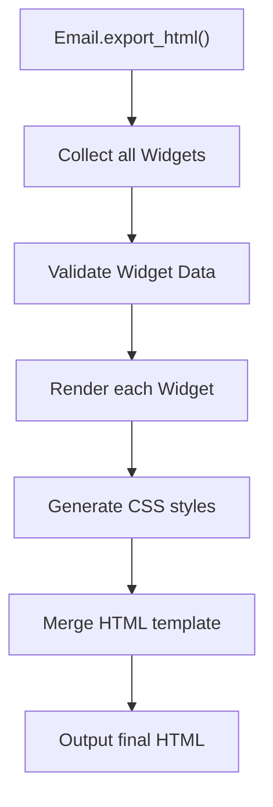

# Creating Custom Widgets

This guide provides detailed instructions on how to create custom components in EmailWidget, from basic concepts to complete implementation.

## 🎯 Widget Architecture Overview

### Core Concepts

EmailWidget uses a component-based architecture where all display elements are Widgets:

```
BaseWidget (Abstract Base Class)
├── TextWidget (Text component)
├── TableWidget (Table component)
├── ProgressWidget (Progress bar component)
├── AlertWidget (Alert box component)
├── CustomWidget (Your custom component)
└── ...
```

## 🎨 Template System

### Jinja2 Integration

EmailWidget uses Jinja2 as its template engine:

```python
from email_widget.core.template_engine import TemplateEngine

# Get template engine
engine = TemplateEngine()

# Render template
template = engine.get_template("widget_template.html")
html = template.render(context={"title": "Title", "content": "Content"})
```

### Template Structure

Typical Widget template structure:

```html
<!-- widget_template.html -->
<div class="widget {{ widget_type }}" id="{{ widget_id }}">
    <div class="widget-header">
        <h3>{{ title }}</h3>
    </div>
    <div class="widget-content">
        {{ content|safe }}
    </div>
</div>
```

### Custom Templates

You can create templates for custom Widgets:

```python
class CustomWidget(BaseWidget):
    def __init__(self):
        super().__init__()
        self.template_name = "custom_widget.html"
    
    def get_template_context(self) -> dict:
        return {
            "title": self.title,
            "custom_data": self.custom_data,
            **super().get_template_context()
        }
```

## 🔄 Rendering Process

### Rendering Flow

EmailWidget's rendering process:



### Performance Optimization

EmailWidget performs multiple optimizations during rendering:

- **Template Caching** - Avoid repeated template parsing
- **Lazy Loading** - Load resources on demand
- **HTML Compression** - Reduce file size
- **Image Optimization** - Automatic compression and encoding

### BaseWidget Base Class

All Widgets must inherit from `BaseWidget`:

```python
from email_widget.core.base import BaseWidget
from typing import Any, Dict, Optional

class BaseWidget:
    """Widget base class defining common interface"""
    
    def __init__(self):
        """Initialize basic attributes"""
        self._id: Optional[str] = None
        self._css_classes: List[str] = []
        self._custom_styles: Dict[str, str] = {}
    
    def render(self) -> str:
        """Render Widget to HTML - subclasses must implement"""
        raise NotImplementedError("Subclasses must implement render method")
    
    def set_id(self, widget_id: str) -> 'BaseWidget':
        """Set Widget ID"""
        self._id = widget_id
        return self
    
    def add_css_class(self, css_class: str) -> 'BaseWidget':
        """Add CSS class"""
        if css_class not in self._css_classes:
            self._css_classes.append(css_class)
        return self
    
    def set_custom_style(self, property_name: str, value: str) -> 'BaseWidget':
        """Set custom style"""
        self._custom_styles[property_name] = value
        return self
```

## 🛠️ Development Process

### 1. Design Phase

Before starting to code, clarify the following questions:

**Functionality Definition**
- What is the primary purpose of the Widget?
- What data needs to be displayed?
- How will users interact with it?

**API Design**
- What configuration methods are needed?
- What are the parameter types and default values?
- Should it support method chaining?

**Style Design**
- What are the default styles?
- What customization options are supported?
- How to ensure email client compatibility?

### 2. Implementation Phase

#### Step 1: Create Basic Structure

```python
from email_widget.core.base import BaseWidget
from email_widget.core.validators import TypeValidator
from typing import Optional, Union

class CustomWidget(BaseWidget):
    """Custom Widget example"""
    
    def __init__(self):
        super().__init__()
        # Initialize Widget-specific attributes
        self._title: str = ""
        self._content: str = ""
        self._theme: str = "default"
        
        # Initialize validators
        self._validators = {
            'title': TypeValidator(str),
            'content': TypeValidator(str),
            'theme': TypeValidator(str)
        }
    
    def render(self) -> str:
        """Render to HTML"""
        # Implement rendering logic
        pass
```

#### Step 2: Implement Configuration Methods

```python
def set_title(self, title: str) -> 'CustomWidget':
    """Set title"""
    self._validators['title'].validate(title)
    self._title = title
    return self

def set_content(self, content: str) -> 'CustomWidget':
    """Set content"""
    self._validators['content'].validate(content)
    self._content = content
    return self

def set_theme(self, theme: str) -> 'CustomWidget':
    """Set theme"""
    allowed_themes = ['default', 'primary', 'success', 'warning', 'danger']
    if theme not in allowed_themes:
        raise ValueError(f"Theme must be one of: {allowed_themes}")
    self._theme = theme
    return self
```

#### Step 3: Implement Rendering Logic

```python
def render(self) -> str:
    """Render to HTML"""
    # Generate CSS class names
    css_classes = ['custom-widget', f'theme-{self._theme}'] + self._css_classes
    class_attr = f'class="{" ".join(css_classes)}"' if css_classes else ''
    
    # Generate ID attribute
    id_attr = f'id="{self._id}"' if self._id else ''
    
    # Generate inline styles
    styles = self._get_default_styles()
    styles.update(self._custom_styles)
    style_attr = f'style="{self._generate_style_string(styles)}"' if styles else ''
    
    # Combine attributes
    attributes = ' '.join(filter(None, [class_attr, id_attr, style_attr]))
    
    return f"""
    <div {attributes}>
        {self._render_title()}
        {self._render_content()}
    </div>
    """

def _render_title(self) -> str:
    """Render title section"""
    if not self._title:
        return ""
    
    return f'<h3 style="margin: 0 0 10px 0; color: #2c3e50;">{self._title}</h3>'

def _render_content(self) -> str:
    """Render content section"""
    if not self._content:
        return ""
    
    return f'<div class="email-preview-wrapper">
<div style="line-height: 1.6;">{self._content}</div>
</div>'

def _get_default_styles(self) -> Dict[str, str]:
    """Get default styles"""
    theme_colors = {
        'default': '#f8f9fa',
        'primary': '#007bff',
        'success': '#28a745',
        'warning': '#ffc107',
        'danger': '#dc3545'
    }
    
    return {
        'background-color': theme_colors.get(self._theme, theme_colors['default']),
        'border': '1px solid #dee2e6',
        'border-radius': '4px',
        'padding': '15px',
        'margin': '10px 0',
        'font-family': 'Arial, sans-serif'
    }

def _generate_style_string(self, styles: Dict[str, str]) -> str:
    """Generate style string"""
    return '; '.join(f'{key}: {value}' for key, value in styles.items())
```

## 📝 Complete Example: Rating Card Widget

Let's create a complete rating card component as an example:

```python
from email_widget.core.base import BaseWidget
from email_widget.core.validators import TypeValidator, RangeValidator
from typing import Optional

class RatingCardWidget(BaseWidget):
    """Rating Card Widget"""
    
    def __init__(self):
        super().__init__()
        self._title: str = ""
        self._rating: float = 0.0
        self._max_rating: float = 5.0
        self._description: str = ""
        self._show_stars: bool = True
        self._color_scheme: str = "default"
        
        # Set validators
        self._validators = {
            'title': TypeValidator(str),
            'rating': RangeValidator(0, 10),
            'max_rating': RangeValidator(1, 10),
            'description': TypeValidator(str)
        }
    
    def set_title(self, title: str) -> 'RatingCardWidget':
        """Set card title"""
        self._validators['title'].validate(title)
        self._title = title
        return self
    
    def set_rating(self, rating: float, max_rating: float = 5.0) -> 'RatingCardWidget':
        """Set rating"""
        self._validators['rating'].validate(rating)
        self._validators['max_rating'].validate(max_rating)
        
        if rating > max_rating:
            raise ValueError(f"Rating ({rating}) cannot exceed maximum ({max_rating})")
        
        self._rating = rating
        self._max_rating = max_rating
        return self
    
    def set_description(self, description: str) -> 'RatingCardWidget':
        """Set description text"""
        self._validators['description'].validate(description)
        self._description = description
        return self
    
    def set_show_stars(self, show: bool) -> 'RatingCardWidget':
        """Set whether to show star icons"""
        self._show_stars = show
        return self
    
    def set_color_scheme(self, scheme: str) -> 'RatingCardWidget':
        """Set color scheme"""
        allowed_schemes = ['default', 'gold', 'blue', 'green', 'red']
        if scheme not in allowed_schemes:
            raise ValueError(f"Color scheme must be: {allowed_schemes}")
        self._color_scheme = scheme
        return self
    
    def render(self) -> str:
        """Render rating card"""
        # Get styles
        styles = self._get_card_styles()
        styles.update(self._custom_styles)
        style_attr = self._generate_style_string(styles)
        
        # Generate other attributes
        css_classes = ['rating-card'] + self._css_classes
        class_attr = f'class="{" ".join(css_classes)}"'
        id_attr = f'id="{self._id}"' if self._id else ''
        
        attributes = ' '.join(filter(None, [class_attr, id_attr, f'style="{style_attr}"']))
        
        return f"""
        <div {attributes}>
            {self._render_header()}
            {self._render_rating()}
            {self._render_description()}
        </div>
        """
    
    def _render_header(self) -> str:
        """Render header"""
        if not self._title:
            return ""
        
        return f"""
        <div class="email-preview-wrapper">
<div style="margin-bottom: 15px;">
            <h3 style="margin: 0; font-size: 18px; color: #2c3e50; font-weight: 600;">
                {self._title}
            </h3>
        </div>
</div>
        """
    
    def _render_rating(self) -> str:
        """Render rating display"""
        percentage = (self._rating / self._max_rating) * 100
        
        # Numeric rating
        rating_number = f"""
        <div class="email-preview-wrapper">
<div style="font-size: 24px; font-weight: bold; color: {self._get_rating_color()}; margin-bottom: 5px;">
            {self._rating:.1f} / {self._max_rating:.0f}
        </div>
</div>
        """
        
        # Stars display
        stars_html = ""
        if self._show_stars:
            stars_html = f"""
            <div class="email-preview-wrapper">
<div style="margin-bottom: 8px;">
                {self._generate_stars()}
            </div>
</div>
            """
        
        # Progress bar
        progress_bar = f"""
        <div class="email-preview-wrapper">
<div style="background-color: #e9ecef; border-radius: 10px; height: 8px; overflow: hidden;">
            <div style="
                background-color: {self._get_rating_color()};
                height: 100%;
                width: {percentage:.1f}%;
                border-radius: 10px;
                transition: width 0.3s ease;
            "></div>
</div>
        </div>
        """
        
        return f"""
        <div class="email-preview-wrapper">
<div style="text-align: center; margin-bottom: 15px;">
            {rating_number}
            {stars_html}
            {progress_bar}
        </div>
</div>
        """
    
    def _render_description(self) -> str:
        """Render description"""
        if not self._description:
            return ""
        
        return f"""
        <div class="email-preview-wrapper">
<div style="
            color: #6c757d;
            font-size: 14px;
            line-height: 1.5;
            text-align: center;
            margin-top: 10px;
        ">
            {self._description}
        </div>
</div>
        """
    
    def _generate_stars(self) -> str:
        """Generate star icons"""
        full_stars = int(self._rating)
        has_half_star = (self._rating - full_stars) >= 0.5
        empty_stars = int(self._max_rating) - full_stars - (1 if has_half_star else 0)
        
        stars_html = ""
        
        # Full stars
        for _ in range(full_stars):
            stars_html += '<span style="color: #ffc107; font-size: 18px;">★</span>'
        
        # Half star
        if has_half_star:
            stars_html += '<span style="color: #ffc107; font-size: 18px;">☆</span>'
        
        # Empty stars
        for _ in range(empty_stars):
            stars_html += '<span style="color: #dee2e6; font-size: 18px;">☆</span>'
        
        return stars_html
    
    def _get_rating_color(self) -> str:
        """Get color based on rating"""
        if self._color_scheme != 'default':
            colors = {
                'gold': '#ffc107',
                'blue': '#007bff',
                'green': '#28a745',
                'red': '#dc3545'
            }
            return colors.get(self._color_scheme, '#007bff')
        
        # Dynamically set color based on rating
        percentage = (self._rating / self._max_rating) * 100
        if percentage >= 80:
            return '#28a745'  # Green - Excellent
        elif percentage >= 60:
            return '#ffc107'  # Yellow - Good
        elif percentage >= 40:
            return '#fd7e14'  # Orange - Average
        else:
            return '#dc3545'  # Red - Poor
    
    def _get_card_styles(self) -> dict:
        """Get card styles"""
        return {
            'background': 'linear-gradient(135deg, #ffffff 0%, #f8f9fa 100%)',
            'border': '1px solid #dee2e6',
            'border-radius': '12px',
            'padding': '20px',
            'margin': '15px 0',
            'box-shadow': '0 2px 8px rgba(0, 0, 0, 0.1)',
            'font-family': "'Segoe UI', Tahoma, Geneva, Verdana, sans-serif",
            'text-align': 'left'
        }
    
    def _generate_style_string(self, styles: dict) -> str:
        """Generate style string"""
        return '; '.join(f'{key}: {value}' for key, value in styles.items())


# Usage example
def demo_rating_card():
    """Rating card usage example"""
    from email_widget import Email
    
    email = Email("Rating Card Demo")
    
    # Create different types of rating cards
    
    # Product rating
    product_rating = RatingCardWidget()
    product_rating.set_title("Product User Satisfaction") \
                  .set_rating(4.3, 5.0) \
                  .set_description("Average score based on 1,247 user reviews") \
                  .set_color_scheme("gold")
    
    email.add_widget(product_rating)
    
    # Service rating
    service_rating = RatingCardWidget()
    service_rating.set_title("Customer Service Rating") \
                  .set_rating(8.7, 10.0) \
                  .set_description("Customer service team performance this month") \
                  .set_color_scheme("green") \
                  .set_show_stars(False)
    
    email.add_widget(service_rating)
    
    # Website performance rating
    performance_rating = RatingCardWidget()
    performance_rating.set_title("Website Performance Score") \
                      .set_rating(2.1, 5.0) \
                      .set_description("Page loading speed needs optimization") \
                      .set_color_scheme("red")
    
    email.add_widget(performance_rating)
    
    email.export_html("rating_card_demo.html")
    print("✅ Rating card demo generated")

if __name__ == "__main__":
    demo_rating_card()
```

## 🧪 Testing Custom Widgets

Create corresponding test file `tests/test_rating_card_widget.py`:

```python
import pytest
from email_widget.widgets.rating_card_widget import RatingCardWidget

class TestRatingCardWidget:
    """Rating Card Widget tests"""
    
    def test_initialization(self):
        """Test initialization"""
        widget = RatingCardWidget()
        assert widget._title == ""
        assert widget._rating == 0.0
        assert widget._max_rating == 5.0
        assert widget._show_stars is True
    
    def test_set_title(self):
        """Test setting title"""
        widget = RatingCardWidget()
        result = widget.set_title("Test Title")
        
        assert result is widget  # Test method chaining
        assert widget._title == "Test Title"
    
    def test_set_rating(self):
        """Test setting rating"""
        widget = RatingCardWidget()
        widget.set_rating(4.5, 5.0)
        
        assert widget._rating == 4.5
        assert widget._max_rating == 5.0
    
    def test_invalid_rating(self):
        """Test invalid rating"""
        widget = RatingCardWidget()
        
        with pytest.raises(ValueError):
            widget.set_rating(6.0, 5.0)  # Rating exceeds maximum
    
    def test_render_basic(self):
        """Test basic rendering"""
        widget = RatingCardWidget()
        widget.set_title("Test Rating").set_rating(4.0, 5.0)
        
        html = widget.render()
        
        assert "Test Rating" in html
        assert "4.0" in html
        assert "class=" in html
        assert "style=" in html
    
    def test_render_with_description(self):
        """Test rendering with description"""
        widget = RatingCardWidget()
        widget.set_title("Test").set_rating(3.5).set_description("Test description")
        
        html = widget.render()
        assert "Test description" in html
    
    def test_color_schemes(self):
        """Test color schemes"""
        widget = RatingCardWidget()
        
        # Test valid color schemes
        for scheme in ['default', 'gold', 'blue', 'green', 'red']:
            widget.set_color_scheme(scheme)
            assert widget._color_scheme == scheme
        
        # Test invalid color scheme
        with pytest.raises(ValueError):
            widget.set_color_scheme("invalid")
    
    def test_stars_generation(self):
        """Test star generation"""
        widget = RatingCardWidget()
        widget.set_rating(3.5, 5.0)
        
        # Test star HTML generation (need to implement _generate_stars test)
        stars_html = widget._generate_stars()
        assert "★" in stars_html  # Should contain full stars
        assert "☆" in stars_html  # Should contain empty or half stars

# Run tests
if __name__ == "__main__":
    pytest.main([__file__, "-v"])
```

## 📋 Best Practices

### 1. Follow Design Principles

**Single Responsibility Principle**
- Each Widget should only be responsible for one specific display function
- Avoid creating overly complex components

**Open/Closed Principle**
- Open for extension, closed for modification
- Implement functionality extension through inheritance and composition

**Liskov Substitution Principle**
- Subclasses should be able to replace parent classes
- Maintain interface consistency

### 2. Code Quality

**Input Validation**
```python
def set_value(self, value: Any) -> 'CustomWidget':
    """Validate when setting value"""
    if not self._validate_value(value):
        raise ValueError(f"Invalid value: {value}")
    self._value = value
    return self

def _validate_value(self, value: Any) -> bool:
    """Validate if value is valid"""
    # Implement specific validation logic
    return True
```

**Error Handling**
```python
def render(self) -> str:
    """Safe rendering method"""
    try:
        return self._safe_render()
    except Exception as e:
        # Log error but don't interrupt entire email generation
        return f'<div class="widget-error">Widget rendering failed: {str(e)}</div>'

def _safe_render(self) -> str:
    """Actual rendering logic"""
    # Implement rendering
    pass
```

**Performance Optimization**
```python
from functools import lru_cache

class CustomWidget(BaseWidget):
    
    @lru_cache(maxsize=128)
    def _get_cached_template(self, template_key: str) -> str:
        """Cache template content"""
        # Avoid repeatedly generating the same template
        return self._generate_template(template_key)
```

### 3. Email Client Compatibility

**Use Inline Styles**
```python
def render(self) -> str:
    # Good: Use inline styles
    return '<div class="email-preview-wrapper">
<div style="color: red; font-size: 16px;">Content</div>
</div>'
    
    # Avoid: Use external CSS classes (many email clients don't support)
    # return '<div class="my-class">Content</div>'
```

**Avoid Complex Layouts**
```python
# Good: Use table layout
def _render_layout(self) -> str:
    return '''
    <table style="width: 100%; border-collapse: collapse;">
        <tr>
            <td style="padding: 10px;">Left column</td>
            <td style="padding: 10px;">Right column</td>
        </tr>
    </table>
    '''

# Avoid: Use flexbox or grid (poor compatibility)
```

**Test Multiple Email Clients**
- Outlook 2013/2016/2019
- Gmail (web and mobile)
- Apple Mail
- Thunderbird

### 4. Documentation and Examples

Write clear documentation for your Widget:

```python
class CustomWidget(BaseWidget):
    """
    Custom Widget component
    
    This Widget is used to display...
    
    Example usage:
        >>> widget = CustomWidget()
        >>> widget.set_title("Title").set_content("Content")
        >>> html = widget.render()
    
    Supported configuration options:
        - title: Title text
        - content: Main content
        - theme: Theme style (default, primary, success, warning, danger)
    
    Args:
        None
        
    Returns:
        CustomWidget: Widget instance, supports method chaining
        
    Raises:
        ValueError: When parameter values are invalid
    """
```

## 🚀 Advanced Techniques

### 1. Template System Support

```python
from jinja2 import Template

class AdvancedWidget(BaseWidget):
    """Advanced Widget with template support"""
    
    def __init__(self):
        super().__init__()
        self._template = None
        self._data = {}
    
    def set_template(self, template_string: str) -> 'AdvancedWidget':
        """Set custom template"""
        self._template = Template(template_string)
        return self
    
    def set_data(self, **kwargs) -> 'AdvancedWidget':
        """Set template data"""
        self._data.update(kwargs)
        return self
    
    def render(self) -> str:
        if self._template:
            return self._template.render(**self._data)
        return self._default_render()
```

### 2. Responsive Design

```python
class ResponsiveWidget(BaseWidget):
    """Widget with responsive support"""
    
    def render(self) -> str:
        return f'''
        <div class="email-preview-wrapper">
<div style="width: 100%; max-width: 600px;">
            <style>
                @media (max-width: 600px) {{
                    .responsive-content {{ font-size: 14px !important; }}
                }}
            </style>
            <div class="responsive-content" style="font-size: 16px;">
                {self._content}
            </div>
</div>
        </div>
        '''
```

### 3. Data Binding

```python
import pandas as pd

class DataBoundWidget(BaseWidget):
    """Widget with data binding support"""
    
    def bind_dataframe(self, df: pd.DataFrame, columns: list = None) -> 'DataBoundWidget':
        """Bind DataFrame data"""
        self._dataframe = df
        self._columns = columns or df.columns.tolist()
        return self
    
    def render(self) -> str:
        if hasattr(self, '_dataframe'):
            return self._render_from_dataframe()
        return self._render_static()
```

## 📦 Publishing Custom Widgets

### 1. Code Organization

```
email_widget/
├── widgets/
│   ├── __init__.py
│   ├── custom_widget.py          # Your Widget
│   └── rating_card_widget.py     # Rating Card Widget
├── tests/
│   ├── test_widgets/
│   │   ├── test_custom_widget.py
│   │   └── test_rating_card_widget.py
└── docs/
    └── widgets/
        ├── custom_widget.md
        └── rating_card_widget.md
```

### 2. Register Widget

Register in `email_widget/widgets/__init__.py`:

```python
from .custom_widget import CustomWidget
from .rating_card_widget import RatingCardWidget

__all__ = [
    'CustomWidget',
    'RatingCardWidget',
    # ... other Widgets
]
```

### 3. Add to Convenience Methods

Add convenience methods to `Email` class:

```python
class Email:
    def add_rating_card(self, title: str, rating: float, max_rating: float = 5.0, 
                       description: str = "") -> 'Email':
        """Convenience method for adding rating card"""
        widget = RatingCardWidget()
        widget.set_title(title).set_rating(rating, max_rating)
        if description:
            widget.set_description(description)
        return self.add_widget(widget)
```

## 🎉 Summary

Key points for creating custom Widgets:

1. **Inherit BaseWidget** - Follow architectural conventions
2. **Implement render method** - Core rendering logic
3. **Support method chaining** - Improve API usability
4. **Input validation** - Ensure data safety
5. **Email compatibility** - Use inline styles
6. **Write tests** - Ensure code quality
7. **Complete documentation** - Help other developers

Now you have mastered the complete process of creating custom Widgets. Start creating your own components! 🚀