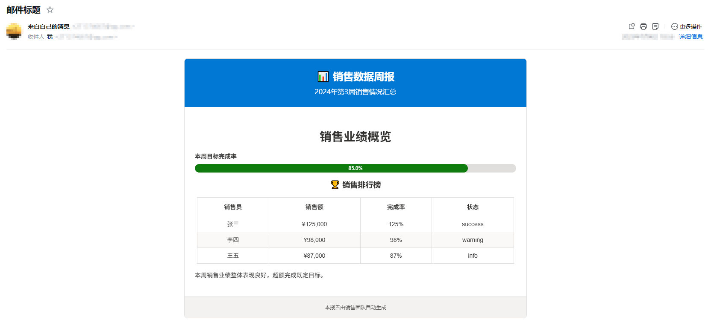

# 📧 Creating Your First Email

This tutorial will guide you through creating your first EmailWidget email report. We'll start with the simplest example and gradually add more features.

## 🎯 Chapter Goals

- Create a basic email object
- Add text, tables, charts, and other components
- Export HTML files
- Send emails to mailboxes

## 🚀 Step 1: The Simplest Email

Let's start with the simplest example:

```python
from email_widget import Email, TextWidget, TextType

email = Email("My First Report")

# Add welcome text
email.add_widget(
    TextWidget()
    .set_content("Welcome to EmailWidget! 🎉")
    .set_type(TextType.TITLE_LARGE)
)

# Export HTML file
file_path = email.export_html("first_email.html")
print(f"Email generated: {file_path}")
```

After running this code, you'll see a file named `first_email.html` in the current directory. Open it with a browser and you'll see a beautiful email page!


!!! success "🎉 Congratulations!"
    You've successfully created your first EmailWidget email!

## 📝 Step 2: Adding More Content

Now let's add more content to create a more complete report:

```python
from email_widget import Email, TextWidget, TableWidget, ProgressWidget
from email_widget.core.enums import TextType, ProgressTheme

# Create email object and set subtitle and footer
email = Email("📊 Weekly Sales Report")
email.set_subtitle("Week 3 2024 Sales Summary")
email.set_footer("This report is automatically generated by the sales team")

# 1. Add main title
email.add_widget(
    TextWidget()
    .set_content("Sales Performance Overview")
    .set_type(TextType.TITLE_LARGE)
)

# 2. Add progress indicator
email.add_widget(
    ProgressWidget()
    .set_value(85)
    .set_label("Weekly Target Completion Rate")
    .set_theme(ProgressTheme.SUCCESS)
)

# 3. Add data table
table = TableWidget()
table.set_title("🏆 Sales Leaderboard")
table.set_headers(["Salesperson", "Sales Amount", "Completion Rate", "Status"])
table.add_row(["Alice", "$125,000", "125%", "success"])
table.add_row(["Bob", "$98,000", "98%", "warning"])
table.add_row(["Charlie", "$87,000", "87%", "info"])
email.add_widget(table)

# 4. Add summary text
email.add_widget(
    TextWidget()
    .set_content("This week's sales performance is overall good, exceeding the set targets.")
    .set_type(TextType.BODY)
)

# Export HTML file
file_path = email.export_html("sales_report.html")
print(f"Sales report generated: {file_path}")
```


## Send to Mailbox

### Using Built-in `EmailSender` to Send Emails (Recommended)

The most convenient way is to directly use the `EmailSender` that comes with `EmailWidget`. Just select the appropriate `EmailSender` and call the `send` method with an `Email` object. Here's a simple example:

```python
from email_widget import Email, QQEmailSender

email = Email("Welcome to EmailWidget")

email.add_card("Python Version", "You need Python 3.10 or higher to use EmailWidget", metadata={"Python Version": "3.10+"})

email.add_quote("EmailWidget is a Python library for building and sending HTML emails.", "EmailWidget")

# Send email with one line of code
QQEmailSender("your_qq_email", "your_qq_email_authorization_code").send(email)
```

Here's the actual effect after sending the email. You can see that the email has been successfully sent and the styling is normal:


### Using smtplib Standard Library

Here we use the standard library smtplib to send emails. In actual development, you can also use other email sending libraries, such as redmail.

!!! warning "Note"

    yagmail has a built-in HTML processing step that removes EmailWidget's CSS styles, so it's currently incompatible. Please use email sending libraries other than yagmail, such as redmail.

```python
from email_widget import Email, TextWidget, TableWidget, ProgressWidget
from email_widget.core.enums import TextType, ProgressTheme
import smtplib
from email.mime.text import MIMEText
from email.header import Header

# Create email object and set subtitle and footer
email = Email("📊 Weekly Sales Report")
email.set_subtitle("Week 3 2024 Sales Summary")
email.set_footer("This report is automatically generated by the sales team")

# 1. Add main title
email.add_widget(
    TextWidget().set_content("Sales Performance Overview").set_type(TextType.TITLE_LARGE)
)

# 2. Add progress indicator
email.add_widget(
    ProgressWidget()
    .set_value(85)
    .set_label("Weekly Target Completion Rate")
    .set_theme(ProgressTheme.SUCCESS)
)

# 3. Add data table
table = TableWidget()
table.set_title("🏆 Sales Leaderboard")
table.set_headers(["Salesperson", "Sales Amount", "Completion Rate", "Status"])
table.add_row(["Alice", "$125,000", "125%", "success"])
table.add_row(["Bob", "$98,000", "98%", "warning"])
table.add_row(["Charlie", "$87,000", "87%", "info"])
email.add_widget(table)

# 4. Add summary text
email.add_widget(
    TextWidget()
    .set_content("This week's sales performance is overall good, exceeding the set targets.")
    .set_type(TextType.BODY)
)

# Create HTML email body
# Instead of exporting to file, use export_str to export directly as string
msg = MIMEText(email.export_str(), "html", "utf-8")
msg["Subject"] = Header("Email Subject", "utf-8")
msg["From"] = "your_email@qq.com"  # Add sender
msg["To"] = "your_email@qq.com"  # Add recipient

# Connect and send email (using QQ email as example)
smtp = smtplib.SMTP_SSL("smtp.qq.com", 465)
smtp.login("your_email@qq.com", "jjhbkryjybwjbjbh")
smtp.sendmail("your_email@qq.com", "your_email@qq.com", msg.as_string())
smtp.quit()
```

After running, check your mailbox and you'll find the email has been successfully sent:



You can also see the beautiful report on mobile:


### Using redmail to Send Emails

Using redmail to send emails is relatively simpler, but requires installing additional dependencies:

```bash
pip install redmail
```

```python
from redmail import EmailSender
import os
from smtplib import SMTP_SSL
from email_widget import Email, TextWidget, TableWidget, ProgressWidget
from email_widget.core.enums import TextType, ProgressTheme

# Create email object and set subtitle and footer
email = Email("📊 Weekly Sales Report")
email.set_subtitle("Week 3 2024 Sales Summary")
email.set_footer("This report is automatically generated by the sales team")

# 1. Add main title
email.add_widget(
    TextWidget().set_content("Sales Performance Overview").set_type(TextType.TITLE_LARGE)
)

# 2. Add progress indicator
email.add_widget(
    ProgressWidget()
    .set_value(85)
    .set_label("Weekly Target Completion Rate")
    .set_theme(ProgressTheme.SUCCESS)
)

# 3. Add data table
table = TableWidget()
table.set_title("🏆 Sales Leaderboard")
table.set_headers(["Salesperson", "Sales Amount", "Completion Rate", "Status"])
table.add_row(["Alice", "$125,000", "125%", "success"])
table.add_row(["Bob", "$98,000", "98%", "warning"])
table.add_row(["Charlie", "$87,000", "87%", "info"])
email.add_widget(table)

# 4. Add summary text
email.add_widget(
    TextWidget()
    .set_content("This week's sales performance is overall good, exceeding the set targets.")
    .set_type(TextType.BODY)
)

# Configure QQ email sender
email_sender = EmailSender(
    host="smtp.qq.com",
    port=465,
    username="your_email@qq.com",  # Replace with your QQ email
    password="authorization_code",  # SMTP authorization code
    use_starttls=False,
    cls_smtp=SMTP_SSL,
)

# Send email
email_sender.send(
    subject="HTML Test Email",
    sender="your_email@qq.com",  # Replace with your QQ email
    receivers=["your_email@qq.com"],  # Replace with recipient email
    html=email.export_str(),
)

print("Email sent successfully!")
```

## 🚀 Next Steps

Now that you've mastered the basic usage, you can continue learning:

- [Basic Concepts](concepts.md) - Deep dive into EmailWidget's design philosophy
- [User Guide](../user-guide/index.md) - Learn detailed usage of all components
- [Example Code](../examples/index.md) - See more real-world application scenarios

---

!!! question "Having Problems?"
    
    If you encounter any issues while creating your first email, you can:
    
    - Check [FAQ](faq.md)
    - Ask questions in [GitHub Issues](https://github.com/271374667/EmailWidget/issues)
    - Refer to [API Documentation](../api/index.md) for detailed usage