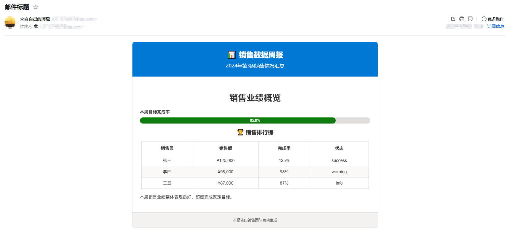
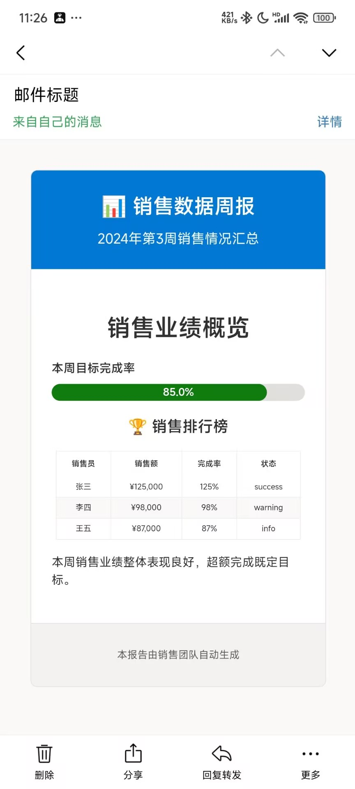

# 📧 创建第一个邮件

这个教程将指导你创建第一个EmailWidget邮件报告。我们将从最简单的例子开始，逐步添加更多功能。

## 🎯 本章目标

- 创建基础邮件对象
- 添加文本、表格、图表等组件
- 导出HTML文件
- 将邮件发送到邮箱

## 🚀 第一步：最简单的邮件

让我们从最简单的例子开始：

```python
from email_widget import Email, TextWidget, TextType

email = Email("我的第一份报告")

# 添加欢迎文本
email.add_widget(
    TextWidget()
    .set_content("欢迎使用 EmailWidget! 🎉")
    .set_type(TextType.TITLE_LARGE)
)

# 导出HTML文件
file_path = email.export_html("first_email.html")
print(f"邮件已生成: {file_path}")
```

运行这个代码，你会在当前目录下看到一个名为 `first_email.html` 的文件。用浏览器打开它，你将看到一个美观的邮件页面！

--8<-- "assets/getting_started/first_email/demo1.html"

!!! success "🎉 恭喜！"
    你已经成功创建了第一个EmailWidget邮件！

## 📝 第二步：添加更多内容

现在让我们添加更多内容，创建一个更完整的报告：

```python
from email_widget import Email, TextWidget, TableWidget, ProgressWidget
from email_widget.core.enums import TextType, ProgressTheme

# 创建邮件对象，并设置副标题和脚注
email = Email("📊 销售数据周报")
email.set_subtitle("2024年第3周销售情况汇总")
email.set_footer("本报告由销售团队自动生成")

# 1. 添加主标题
email.add_widget(
    TextWidget()
    .set_content("销售业绩概览")
    .set_type(TextType.TITLE_LARGE)
)

# 2. 添加进度指标
email.add_widget(
    ProgressWidget()
    .set_value(85)
    .set_label("本周目标完成率")
    .set_theme(ProgressTheme.SUCCESS)
)

# 3. 添加数据表格
table = TableWidget()
table.set_title("🏆 销售排行榜")
table.set_headers(["销售员", "销售额", "完成率", "状态"])
table.add_row(["张三", "¥125,000", "125%", "success"])
table.add_row(["李四", "¥98,000", "98%", "warning"])
table.add_row(["王五", "¥87,000", "87%", "info"])
email.add_widget(table)

# 4. 添加总结文本
email.add_widget(
    TextWidget()
    .set_content("本周销售业绩整体表现良好，超额完成既定目标。")
    .set_type(TextType.BODY)
)

# 导出HTML文件
file_path = email.export_html("sales_report.html")
print(f"销售报告已生成: {file_path}")
```

--8<-- "assets/getting_started/first_email/demo2.html"

## 发送到邮箱

这里使用标准库 smtplib 发送邮件，实际的开发过程中您也可以使用其他的邮件发送库，例如 redmail

!!! warning "注意"

    yagmail 因为自带一个处理 HTML 的过程，会处理掉 EmailWidget 的 CSS 样式，目前无法兼容，请使用除了 yagmail 以外的邮件发送库，例如 redmail

```python
from email_widget import Email, TextWidget, TableWidget, ProgressWidget
from email_widget.core.enums import TextType, ProgressTheme
import smtplib
from email.mime.text import MIMEText
from email.header import Header

# 创建邮件对象，并设置副标题和脚注
email = Email("📊 销售数据周报")
email.set_subtitle("2024年第3周销售情况汇总")
email.set_footer("本报告由销售团队自动生成")

# 1. 添加主标题
email.add_widget(
    TextWidget().set_content("销售业绩概览").set_type(TextType.TITLE_LARGE)
)

# 2. 添加进度指标
email.add_widget(
    ProgressWidget()
    .set_value(85)
    .set_label("本周目标完成率")
    .set_theme(ProgressTheme.SUCCESS)
)

# 3. 添加数据表格
table = TableWidget()
table.set_title("🏆 销售排行榜")
table.set_headers(["销售员", "销售额", "完成率", "状态"])
table.add_row(["张三", "¥125,000", "125%", "success"])
table.add_row(["李四", "¥98,000", "98%", "warning"])
table.add_row(["王五", "¥87,000", "87%", "info"])
email.add_widget(table)

# 4. 添加总结文本
email.add_widget(
    TextWidget()
    .set_content("本周销售业绩整体表现良好，超额完成既定目标。")
    .set_type(TextType.BODY)
)

# 编写HTML类型的邮件正文
# 这里不导出为文件，而是使用 export_str 直接导出为字符串
msg = MIMEText(email.export_str(), "html", "utf-8")
msg["Subject"] = Header("邮件标题", "utf-8")
msg["From"] = "你的邮箱@qq.com"  # 添加发件人
msg["To"] = "你的邮箱@qq.com"  # 添加收件人

# 连接发送邮件(使用QQ邮箱为例)
smtp = smtplib.SMTP_SSL("smtp.qq.com", 465)
smtp.login("你的邮箱@qq.com", "jjhbkryjybwjbjbh")
smtp.sendmail("你的邮箱@qq.com", "你的邮箱@qq.com", msg.as_string())
smtp.quit()
```

运行完毕之后查看邮箱即可发现邮件已经被成功发送了



同时在手机端查看也能看到漂亮的报告



## 🚀 下一步

现在你已经掌握了基础用法，可以继续学习：

- [基本概念](concepts.md) - 深入理解EmailWidget的设计理念
- [用户指南](../user-guide/index.md) - 学习所有组件的详细用法
- [示例代码](../examples/index.md) - 查看更多实际应用场景

---

!!! question "遇到问题？"
    
    如果在创建第一个邮件时遇到任何问题，可以：
    
    - 查看 [常见问题](faq.md)
    - 在 [GitHub Issues](https://github.com/271374667/EmailWidget/issues) 提问
    - 参考 [API文档](../api/index.md) 了解详细用法 